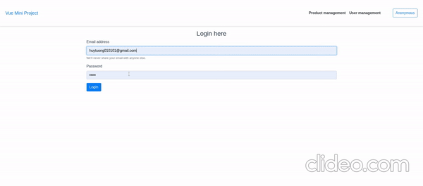

# VUEJS LEARNING-BASED PROJECT

## How to run?

### Mock API
- `cd express-server`
- `npm install`
- `node index`

### Build and run FE
- `cd vue-client`
- `npm install`
- `npm rnu serve`

## Tech
- Vue, Vuex
- axios, sweetalert2

## Demo in a nutshell

